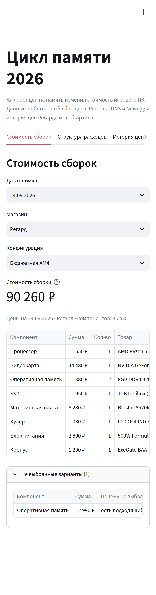
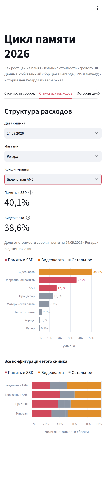
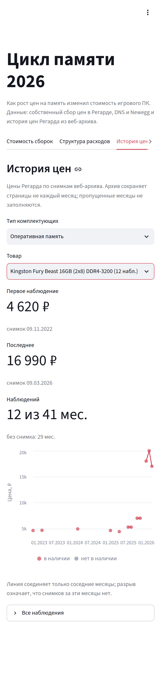
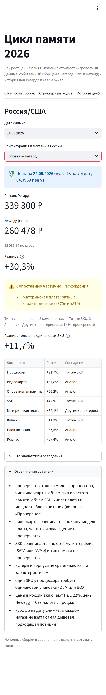

# Цикл памяти 2026: как ИИ-бум перекроил рынок игровых ПК

Исследование рынка и продуктовый кейс: как рост цен на память из-за ИИ-дата-центров изменил стоимость игрового ПК во всех сегментах, кто на этом заработал, кто заплатил и что делать ритейлу. Россия в сравнении с США, на собственных данных.

**Презентация (PDF, 19 слайдов):** [reports/memory_cycle_2026_deck.pdf](reports/memory_cycle_2026_deck.pdf) · **Продуктовый кейс:** [docs/product_case.md](docs/product_case.md) · **Бриф и гипотезы:** [docs/project_brief.md](docs/project_brief.md)
**Инструменты:** Python (pandas, Playwright), сбор цен в DNS, Регарде и Newegg, история цен из Wayback Machine, отраслевые отчёты.

---

## Итог в пяти пунктах

1. **За те же 90 тыс. ₽ покупатель получает класс ниже.** Летом 2025 года в эту сумму помещалась сборка с RTX 5070, сейчас — с RTX 5050. Та же сборка с RTX 5070 подорожала на 44%.
2. **Дорожает именно память.** Одни и те же товары в Регарде: память ×4,4–4,5, SSD ×2–3, видеокарты +40–60% (в них тоже память), а процессоры подешевели. Средняя сборка за год +40%.
3. **Это не только Россия.** В США видеокарты на 25–55% выше рекомендованных цен, память в 5,7 раза дороже минимума. Те же сборки в России дороже, чем в США, на 27–39%, до половины разницы — налог.
4. **Деньги забрали производители памяти.** Три компании делают 89% DRAM, маржа SK hynix — 76%. Гипотеза «DNS заработал на старом складе» не подтвердилась: прибыль DNS за 2025 год −31,5%. Проиграли покупатели и сборщики ПК.
5. **Что делать ритейлу.** Не входить в разворот цикла с дорогим складом памяти и помочь покупателю не откладывать покупку: с той же RTX 5060 сборка на AM4 и DDR4 на 27% дешевле, чем на AM5, но конфигуратор магазина этого не подсказывает. Приоритизация решений, метрики и A/B-тест — в продуктовом кейсе.

## Главное в цифрах

| | |
|---|---|
| **×4,4** | комплект 16 ГБ DDR4-3200 в Регарде: 5 270 ₽ (08.2025) → 23 190 ₽ (09.2026) |
| **+40%** | средняя сборка (RTX 5070, 32 ГБ DDR5) за год: ~148 → 206 тыс. ₽ |
| **+27–39%** | те же сборки в России дороже, чем в США |
| **+93–98%** | рост контрактных цен на DRAM за I кв. 2026 (TrendForce); во II кв. +58–63%, в III кв. прогноз +13–18% |
| **76%** | операционная маржа SK hynix во II кв. 2026 |

**Вывод.** Деньги ИИ-бума осели у производителей памяти и поставщиков дата-центров. Платят геймеры и сборщики ПК: сборщик берёт фиксированную плату за работу, а чек и замороженные в закупке деньги растут. Рост контрактных цен замедляется, цикл разворачивается. Ритейлу и сборщикам нельзя входить в спад с дорогим складом памяти.

## Весь рынок: сегменты и «90 тысяч тогда и сейчас»

| Сборка (Регард, 24.09.2026) | Цена | Доля памяти и SSD |
|---|---|---|
| Бюджетная AM4: RTX 5050, 16 ГБ DDR4 | 90 260 ₽ | 26% |
| Бюджетная AM5: RTX 5060, 16 ГБ DDR5 | 132 190 ₽ | 40% — больше, чем видеокарта |
| Средняя: RTX 5070, 32 ГБ DDR5 | 206 410 ₽ | 38% |
| Топовая: RTX 5080, 32 ГБ DDR5 | 339 300 ₽ | 28% |

- **Летом 2025 года** сборка на AM4 с RTX 5070 стоила ~95 тыс. ₽, сейчас та же сборка — ~136 тыс. ₽ (+44%). На маркетплейсах RTX 5070 доходила до ~50 тыс. ₽ (акция Ozon), и сборка выходила ~81 тыс. ₽. За ~90 тыс. ₽ сейчас собирают с RTX 5050: деньги те же, класс ниже.
- **Средний и топовый сегменты** (одни и те же позиции в Регарде): 32 ГБ DDR5-6000 — 14 680 ₽ (11.2025) → 65 990 ₽ (×4,5); RTX 5070 ASUS PRIME — 66 880 ₽ (08.2025) → 105 730 ₽ (+58%); RTX 5080 AORUS Master — 147 800 ₽ (11.2025) → 203 430 ₽ (+38%); Ryzen 5 9600X подешевел на 5%. Средняя сборка: ~148 тыс. ₽ осенью 2025 года против 206 тыс. ₽ сейчас (+40%, нижняя оценка).
- **Видеокарты за лето 2026 года** подорожали на 40–70%: RTX 5060 — с ~30 до 48–51 тыс. ₽, RTX 5070 — с ~62 до 92–102 тыс. ₽ (iXBT).
- **Рынок сжимается:** в мире поставки ПК в 2026 году −11,3%, средняя цена +17% (IDC); в России продажи настольных ПК за январь–апрель 2026 года −31% в штуках («Известия»).

## Россия и США: те же сборки

| Сборка | Регард | Newegg | Newegg в рублях | Разница |
|---|---|---|---|---|
| Бюджетная AM4 | 90 260 ₽ | $815 | 68 814 ₽ | +31% |
| Бюджетная AM5 | 132 190 ₽ | $1 130 | 95 387 ₽ | +39% |
| Средняя | 206 410 ₽ | $1 922 | 162 250 ₽ | +27% |
| Топовая | 339 300 ₽ | $3 086 | 260 478 ₽ | +30% |

Курс ЦБ на 24.09.2026 — 84,40 ₽/$. В России цены с НДС 22%, в США — без налога с продаж (в среднем ~7%), поэтому до половины разницы — налог.

- **Подорожание глобальное.** В США видеокарты продаются выше рекомендованных цен: RTX 5050 $310 при $249 (+24%), RTX 5060 $460 при $299 (+54%), RTX 5070 $830 при $549 (+51%), RTX 5080 $1 450 при $999 (+45%).
- **Память в США:** комплект DDR5-6000 32 ГБ стоит $409, минимальная цена за всё время — $72, то есть в 5,7 раза дешевле (индекс Tom's Hardware, 14.09.2026).

## Продуктовый кейс: конфигуратор ПК

Что из этого следует для продукта ритейлера — в [docs/product_case.md](docs/product_case.md): задача покупателя, пять решений с приоритизацией RICE, дерево метрик и дизайн A/B-теста. Главное: при той же RTX 5060 сборка на AM4 + DDR4 дешевле AM5 + DDR5 на 35 тыс. ₽ (−27%), но конфигуратор магазина этого не подсказывает. Первое решение — подсказка «дешевле без потери в играх» в готовой корзине.

## Вопросы исследования

1. Насколько подорожал игровой ПК и какие комплектующие дали рост?
2. Уходит ли покупатель на прошлую платформу (AM4 + DDR4), чтобы уложиться в бюджет?
3. Кто в цепочке стоимости заработал на подорожании памяти, а кто проиграл?
4. Опережают ли контрактные цены розничные и можно ли по ним планировать закупки?

## Что подорожало (одни и те же товары в Регарде)

| Позиция | Было | Сейчас | Рост |
|---|---|---|---|
| 8 ГБ DDR4-3200, Kingston ValueRAM | 2 050 ₽ (05.2025) | 10 490 ₽ | ×5,1 |
| 16 ГБ DDR4-3200, Kingston Fury (2×8) | 5 270 ₽ (08.2025) | 23 190 ₽ | ×4,4 |
| 16 ГБ DDR5-5600, Kingston Fury (2×8) | 9 420 ₽ (04.2024) | 33 990 ₽ | ×3,6 |
| SSD 1 ТБ NVMe, Samsung 980 | 10 130 ₽ (08.2025) | 27 990 ₽ | ×2,8 |
| SSD 1 ТБ SATA, Crucial BX500 | 6 410 ₽ (08.2025) | 13 750 ₽ | ×2,1 |
| Видеокарта RTX 3050 8 ГБ, ASUS Dual | 22 930 ₽ (12.2025) | 38 990 ₽ | ×1,7 |
| Видеокарта RTX 5050 8 ГБ, MSI Ventus | 29 730 ₽ (04.2026) | 45 050 ₽ | ×1,5 |
| Процессор Ryzen 5 5600 | 8 720 ₽ (05.2025) | 11 550 ₽ | ×1,3 |
| Материнская плата MSI A520M-A PRO | 4 870 ₽ (08.2025) | 5 710 ₽ | ×1,2 |
| Блок питания DeepCool PF500 | 4 110 ₽ (07.2024) | 3 650 ₽ | ×0,9 |

Память и SSD подорожали в 2–5 раз, видеокарты (в них тоже память, GDDR) — в 1,5–1,7 раза, процессор и материнская плата — на 20–30%. Блок питания, в котором памяти нет, подешевел.

## Кто выиграл, кто проиграл

| Звено | Итог | Данные |
|---|---|---|
| Производители памяти | выиграли | SK hynix: маржа 76%, операционная прибыль ×6,6 за год; выручка отрасли DRAM за I кв. 2026 — 97 млрд $ (+81% за квартал) |
| Дата-центры и их поставщики | выиграли | капзатраты Google, Microsoft, Meta и Amazon на 2026 — 725 млрд $ (+77%) |
| Ритейл (DNS) | спорно | 2025: выручка 781 млрд ₽ (+2,8%), прибыль −31,5%; запасы в ритейле на 8% ниже средних за 2021–2024 (Альфа Банк), на складе заработать сложно |
| Сборщики ПК | проиграли | сборка в DNS ~5 000 ₽ — около 6% цены ПК за 84 тыс. ₽; плата не растёт вместе с железом, заказов меньше |
| Геймеры | проиграли | та же память и SSD стоят в 2–5 раз дороже |

## Данные и как их собрать

```
pip install -r requirements.txt
playwright install chromium

python src/collect_regard.py    # текущие цены Регарда
python src/collect_history.py   # история цен Регарда из Wayback Machine
python src/collect_newegg.py    # текущие цены Newegg (США), те же сборки
python src/collect_local.py --sites dns   # текущие цены DNS, запускать с российского IP
```

`collect_local.py` открывает настоящий браузер: при первом запуске выберите город в DNS и при необходимости пройдите капчу. Правила подбора комплектующих лежат в [`src/components.py`](src/components.py), типовые сборки — в [`data/reference/builds.csv`](data/reference/builds.csv).

**Как сборщики Регарда и Newegg выбирают товар** (с 09.10.2026, [`src/collect_rules.py`](src/collect_rules.py)). Товар принимается, только если пройдены все проверки по порядку:
1. **Категория магазина.** У Регарда — `category_id_char`; товары «из ремонта» лежат в отдельной категории. У Newegg — подкатегория товара, а поиск сразу ограничен ею через параметр `N`.
2. **Состояние.** Только новые: Newegg помечает восстановленные и вскрытые товары флагами, даже когда в названии этого нет.
3. **Наличие.** Товар должен быть в наличии.
4. **Не комплект.** Отсекаются наборы «процессор + кулер» и «плата + процессор».
5. **Модель и характеристики.** Например, «16 ГБ, 2 модуля DDR4», «ATX, сокет AM5, чипсет AMD X870», не SO-DIMM, один объём SSD в объявлении.

Из прошедших берётся самый дешёвый. Если не прошёл ни один, в снимок пишется строка `status=not_found` с числом отсеянных кандидатов по каждой причине, а не случайный аналог. Сборка с таким пропуском считается неполной. В каждой строке снимка есть URL товара, время сбора (UTC), валюта, состояние и категория. Снимки не перезаписываются: дата в имени файла — фактическая дата сбора. Тесты правил — `tests/test_collectors.py`, на сохранённых фрагментах страниц из `tests/fixtures/`.

## Дашборд

Интерактивный дашборд на Streamlit по таблицам из `data/processed/`. Четыре раздела:
1. **Стоимость сборок** — выбор даты, магазина и конфигурации, состав и итог.
2. **Структура расходов** — компоненты на графике, доля памяти и SSD.
3. **История цен** — наблюдения по одному товару.
4. **Россия/США** — курс, дата, типы совпадения, проверенные параметры и ограничения.

```
pip install -r requirements-dashboard.txt
python -m src.pipeline --check        # убедиться, что data/processed/ актуален
streamlit run dashboard/app.py        # откроется http://localhost:8501
python -m unittest                    # тесты, включая прогон дашборда с фильтрами
```

**Публикация.** Дашборд готов к Streamlit Community Cloud: ветка `main`, точка входа `dashboard/app.py`, Python 3.11, зависимости из `dashboard/requirements.txt`. Пошаговая инструкция — [`docs/deploy_streamlit.md`](docs/deploy_streamlit.md). При открытии приложение только читает `data/processed/` и не запускает сборщики цен.

Дата снимка показана рядом с ценами. Неполная сборка помечается предупреждением, её сумма называется «частичная сумма доступных компонентов», а в структуре расходов и сравнении Россия/США такие сборки не участвуют. В истории цен месяцы без снимка не заполняются: линия соединяет только соседние месяцы. Если в данных нет ни одной полной пары Россия/США, раздел сравнения показывает «Нет сопоставимых сборок для выбранных данных», а остальные разделы работают как обычно.

| Стоимость сборок | Структура расходов | История цен | Россия/США |
|---|---|---|---|
|  |  |  |  |

Скриншоты с ширины телефона (390 px) — по снимку 24.09.2026. Версии для экрана компьютера и пример неполной сборки на тестовом наборе лежат в [`docs/dashboard/`](docs/dashboard/). Там же реальная неполная сборка из снимка 09.10.2026 (`6_incomplete_build_2026-10-09_mobile.png`: у Регарда не нашлось ATX-платы на X870) и сравнение Россия/США за эту дату (`7_ru_us_2026-10-09_mobile.png`). Пересоздать их можно командой `python dashboard/screenshots.py docs/dashboard`; нужны Playwright с Chromium и запущенный дашборд.

## Обработанные данные

Исходные CSV в `data/raw/` только читаются. Единый слой обработки (`src/pipeline/`, без внешних зависимостей) собирает из них таблицы для анализа и дашборда в `data/processed/`:

```
python -m src.pipeline            # пересобрать data/processed/
python -m src.pipeline --check    # проверить, что data/processed/ не устарел
python -m unittest                # тесты расчётов
```

**Автоматические проверки.** GitHub Actions (`.github/workflows/checks.yml`) запускается при каждом push и PR. Он ставит `requirements-dashboard.txt`, затем выполняет `python tests/offline.py` и `python -m src.pipeline --check`.
- `tests/offline.py` прогоняет все тесты, включая тесты дашборда, с отключённой сетью. Пропуск теста считается ошибкой.
- Сборщики цен в проверках не запускаются.

| Файл | Что внутри |
|---|---|
| `items.csv` | каждая строка цены: единые названия сборок и компонентов, количество и сумма строки, выбранная альтернатива, ключ товара и класс конфигурации |
| `builds.csv` | одна сборка на снимок магазина: итог, полнота (каких компонентов нет), доли памяти и видеокарты |
| `ru_us_components.csv` | Россия и США по каждому компоненту: тот же SKU, аналог, другие характеристики или не проверено |
| `ru_us_builds.csv` | Россия и США по сборке: наценка на всю сборку и только на одинаковые SKU, сопоставимость и её ограничения |
| `ru_us_limitations.csv` | ограничения, общие для любого сравнения Россия/США |
| `price_history.csv` | месячная история цен Регарда из веб-архива |
| `observations.csv` | отдельные цены со скриншотов, с количеством для сборки |

Правила:
- **Названия.** `budget` → `budget_am5`; `ram_kit`, `ram_single`, `ram_ddr4/5` → `ram` с вариантом; `ssd_sata/nvme` → `ssd`. Неизвестное имя сборки, компонента или файла — ошибка, а не тихий пропуск.
- **Количество.** Сумма строки = цена × количество; для Регарда проверяется, что она совпадает с колонкой `price`.
- **Альтернативы памяти.** Выбирается самый дешёвый вариант, который даёт объём и тип памяти из типовой сборки; при равной цене — вариант с меньшим числом планок. Вариант, который не подходит, не выбирается никогда — даже если он единственный или все варианты не подходят: тогда памяти в сборке нет.
- **Неполные сборки.** Отмечаются (`complete=false`, список недостающих компонентов и причина: не собрано или ни один вариант не подходит) и не участвуют в сравнении Россия/США.
- **Сравнение Россия/США.** `same_sku` — тот же товар (линейка и объём или общий парт-номер; у процессоров ещё и одинаковая упаковка OEM/BOX); `analogous` — другой товар того же класса (тот же чип видеокарты, объём и частота памяти, мощность блока питания); `different_spec` — магазины выбрали разные характеристики; `unverified` — в названии не хватает данных. Сборка «сопоставима по проверенным параметрам», если у неё нет компонентов `different_spec` и `unverified`; иначе — «сопоставима частично», с перечислением расхождений. Это не полная равнозначность: проверяются только параметры из колонки `checked_params`, а общие ограничения (модель платы видеокарты, интерфейс SSD, кулеры и корпуса, НДС в России против цен без налога на Newegg) лежат в `ru_us_limitations.csv`. Курс — `data/reference/fx_rates.csv`.

## Структура

```
data/raw/          собранные цены (DNS, Регард, Newegg, история из архива), не изменяются
data/reference/    типовые сборки, курс валют
data/processed/    обработанные таблицы (python -m src.pipeline)
docs/              бриф проекта, продуктовый кейс, скриншоты дашборда
src/               сбор цен; src/pipeline/ — обработка
dashboard/         дашборд Streamlit (streamlit run dashboard/app.py)
tests/             тесты обработки
reports/           презентация и выгрузки
```

## Источники

- TrendForce, пресс-релизы о контрактных ценах: [05.01.2026](https://www.trendforce.com/presscenter/news/20260105-12860.html), [31.03.2026](https://www.trendforce.com/presscenter/news/20260331-12995.html), [01.06.2026](https://www.trendforce.com/presscenter/news/20260601-13070.html), [03.07.2026](https://www.trendforce.com/presscenter/news/20260703-13134.html)
- [SK hynix, результаты за II кв. 2026](https://news.skhynix.com/en/q2-2026-business-results/)
- [IDC: прогноз рынка ПК на 2026 год](https://www.idc.com/resource-center/blog/pc-market-enters-volatile-territory-as-memory-shortage-persists-through-2027/)
- [«Известия»: продажи настольных ПК в России](https://iz.ru/2116922/valerii-kodachigov/v-rf-ruhnuli-prodazhi-nastolnyh-kompyuterov)
- [iXBT: цены на RTX 50 в России, июль и сентябрь 2026](https://www.ixbt.com/live/3dv/rtx-50-snova-dorozhayut-rtx-5070-uzhe-okolo-100-tysyach-pokupat-seychas-ili-zhdat.html)
- [Tom's Hardware: индекс цен на память DDR4 и DDR5 (14.09.2026)](https://www.tomshardware.com/pc-components/ram/ram-price-index-2026-lowest-price-on-ddr5-and-ddr4-memory-of-all-capacities)
- Newegg, собственный сбор цен 24.09.2026; курс ЦБ РФ на 24.09.2026
- [Tom's Hardware: капзатраты облачных компаний в 2026](https://www.tomshardware.com/tech-industry/big-tech/big-techs-ai-spending-plans-reach-725-billion)
- [Отчётность ООО «ДНС Ритейл» за 2025 (Финмаркет)](https://lenta.profinansy.ru/news/7051221)
- [АРКИ: рынок компьютерных клубов, IV кв. 2025 (CNews)](https://www.cnews.ru/news/line/2026-01-30_rynok_kompyuternyh_klubov)
- KPMG и GSA, Global Semiconductor Industry Outlook 2026: опрос 151 руководителя индустрии, IV кв. 2025
- Newzoo, PC & Console Gaming Report 2026
- Эксперт РА, «Бутылочные горлышки индустрии чипов», июль 2026 (доли рынка DRAM по данным Counterpoint, рост цен на DDR5)
- Альфа Банк, «Российский ритейл и Ecom 2026», март 2026 (рынок техники, запасы ритейлеров)
- Data Insight, «Каналы продаж бытовой техники и электроники в России», ноябрь 2025

## Ограничения

- Архив сохраняет не каждый месяц, поэтому в истории цен есть пропуски.
- Учтены DNS, Регард и Newegg (США); маркетплейсы и Авито не учтены (результаты там слишком шумные).
- Лаг между контрактными и розничными ценами ещё не посчитан.
- Экономика сборщиков — оценка: открытой отчётности у них нет.
- Снимок 08.10.2026 (черновой PR #4) собран старыми сборщиками и содержит ошибки (готовые ПК вместо процессоров, плата из ремонта, пропуски); в расчёты он не входит.
- Тайминги памяти (CL) Newegg в названиях не указывает, поэтому в сравнении Россия/США они не проверяются.

## Автор

[tomskboy](https://github.com/tomskboy). Вопросы и замечания — в Issues.
